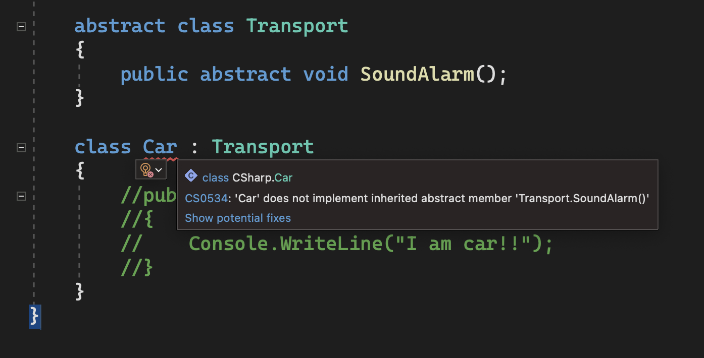

# Interface

## Virtual와 Abstract의 차이

### Virtual
상속받을 자식 클래스에서 override 함수를 만들어 서로 다른 자식 클래스들이 서로 다른 동작 수행을 가능하게 한다. **구현강제성**이 없어서 자식 클래스가 override 함수가 없을 경우 호출 시 부모 클래스 안의 함수를 실행한다. 
```csharp
class Monster
{
    public virtual void Shout(){ }
}

class Orc : Monster
{
    public override void Shout()
    {
        Console.WriteLine("Loktar Ogar!!");
    }
}
```

### Abstract
기능은 Virtual과 같으나 **구현강제성**이 있어서 자식 클래스가 override 함수가 없을 경우 에러를 뱉어낸다.



### 다중상속

C++은 다중 상속을 지원했었지만, C#은 지원하지 않는다. 


이 문제를 해결하기 위해서 interface를 사용한다.

## Interface


인터페이스 타입의 오브젝트로도 다양한 사용이 가능하다.


