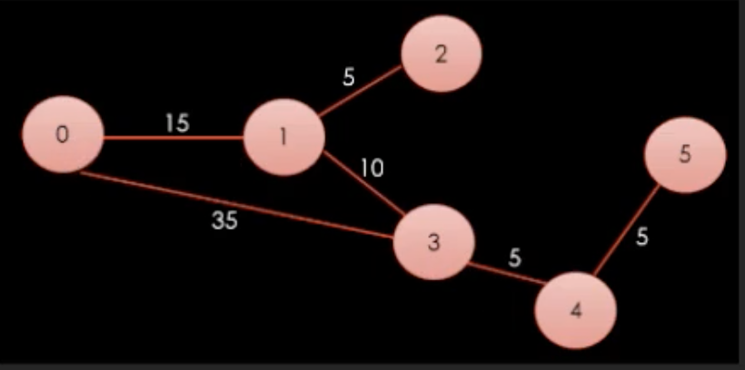

# Dajikstra's Algorithm



## 개념

Dijkstra(다익스트라) 알고리즘은 그래프 내의 한 정점에서 다른 모든 정점까지의 최단 경로를 찾는 알고리즘이다. 이 알고리즘이 주로 사용되는 경우는 경로 찾기 문제들인데, 예를 들면 GPS에서 한 위치에서 다른 위치로 가는 가장 빠른 길을 찾을 때, 네트워크 라우팅에서 데이터 패킷이 목적지까지 어떤 경로로 이동할지 정할 때 등 다양한 분야에서 활용된다.

## 기본원리

1. **초기화**: <br>시작 정점의 거리는 0으로, 다른 모든 정점의 거리는 무한대로 초기화함.
2. **방문 안 한 노드 집합**: <br>모든 노드를 "방문 안한 노드 집합"에 넣는다. 
3. **최소 거리 노드 탐색**: <br>"방문 안한 노드 집합"에서 최소 거리를 가진 노드를 찾는다.
4. **이웃노드 거리 업데이트**: <br>선택된 노드의 이웃 노드들의 거리를 업데이트한다. 만약 현재 노드를 거쳐 이웃 노드로 가는 거리가 이전 거리보다 짧다면, 이웃 노드의 거리를 업데이트하고 이웃 노드의 이전 노드를 현재 노드로 업데이트함.
5. **방문 노드 마킹**: <br>선택된 노드를 "방문 안한 노드 집합"에서 제거하고, "방문한 노드 집합"에 추가한다.
6. **방문 안 한 노드 집합**이 비어있지 않으면 3번으로 돌아가 반복.

## 예제코드

```csharp
using System;
using System.Collections.Generic;
using System.Linq;

namespace DijkstrasAlgorithm
{
    class Program
    {
        static void Main(string[] args)
        {
            // 인접 행렬로 그래프를 표현합니다.
            // 0은 연결되지 않았음을, 양수는 노드 간 거리를 나타냅니다.
            int[,] graph = {
                { 0, 4, 0, 0, 0, 0, 0, 8, 0 },
                { 4, 0, 8, 0, 0, 0, 0, 11, 0 },
                { 0, 8, 0, 7, 0, 4, 0, 0, 2 },
                { 0, 0, 7, 0, 9, 14, 0, 0, 0 },
                { 0, 0, 0, 9, 0, 10, 0, 0, 0 },
                { 0, 0, 4, 14, 10, 0, 2, 0, 0 },
                { 0, 0, 0, 0, 0, 2, 0, 1, 6 },
                { 8, 11, 0, 0, 0, 0, 1, 0, 7 },
                { 0, 0, 2, 0, 0, 0, 6, 7, 0 }
            };

            Dijkstra(graph, 0); // 0번 정점에서 다른 모든 정점까지의 최단 경로를 찾습니다.
        }

        static void Dijkstra(int[,] graph, int src)
        {
            int V = graph.GetLength(0); // 그래프의 노드 수
            int[] dist = new int[V]; // src로부터의 최단 거리 값을 저장할 배열
            
            bool[] sptSet = new bool[V]; // 최단 경로 트리를 저장할 배열
            
            // 모든 거리 값을 ∞로 초기화하고, sptSet을 false로 초기화합니다.
            for (int i = 0; i < V; i++)
            {
                dist[i] = int.MaxValue;
                sptSet[i] = false;
            }
            
            dist[src] = 0; // 시작 노드의 거리는 항상 0입니다.
            
            // 모든 노드를 한 번씩 확인합니다.
            for (int count = 0; count < V - 1; count++)
            {
                int u = MinimumDistance(dist, sptSet); // 아직 처리되지 않은 노드 중에서 거리가 가장 작은 노드를 선택합니다.
                
                sptSet[u] = true; // 선택한 노드를 처리된 노드로 마킹합니다.

                // 선택한 노드를 기준으로 인접한 노드들의 거리를 업데이트합니다.
                for (int v = 0; v < V; v++)
                    if (!sptSet[v] && Convert.ToBoolean(graph[u, v]) && dist[u] != int.MaxValue && dist[u] + graph[u, v] < dist[v])
                        dist[v] = dist[u] + graph[u, v];
            }
            
            PrintSolution(dist); // 결과 출력
        }
        
        static int MinimumDistance(int[] dist, bool[] sptSet)
        {
            int min = int.MaxValue, min_index = -1;
            
            for (int v = 0; v < dist.Length; v++)
                if (sptSet[v] == false && dist[v] <= min)
                {
                    min = dist[v];
                    min_index = v;
                }
            
            return min_index;
        }
        
        static void PrintSolution(int[] dist)
        {
            Console.WriteLine("Vertex \t\t Distance from Source");
            for (int i = 0; i < dist.Length; i++)
                Console.WriteLine(i + " \t\t " + dist[i]);
        }
    }
}

```