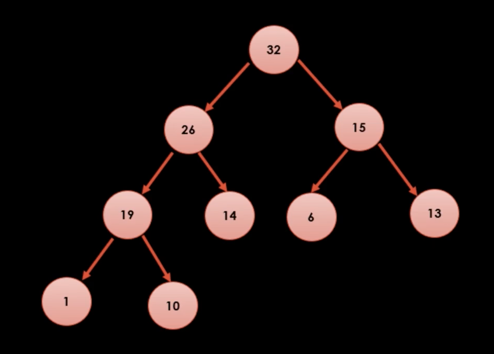
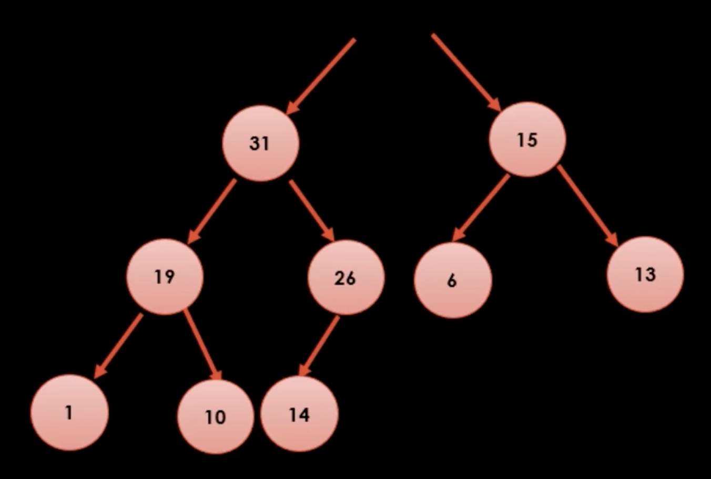
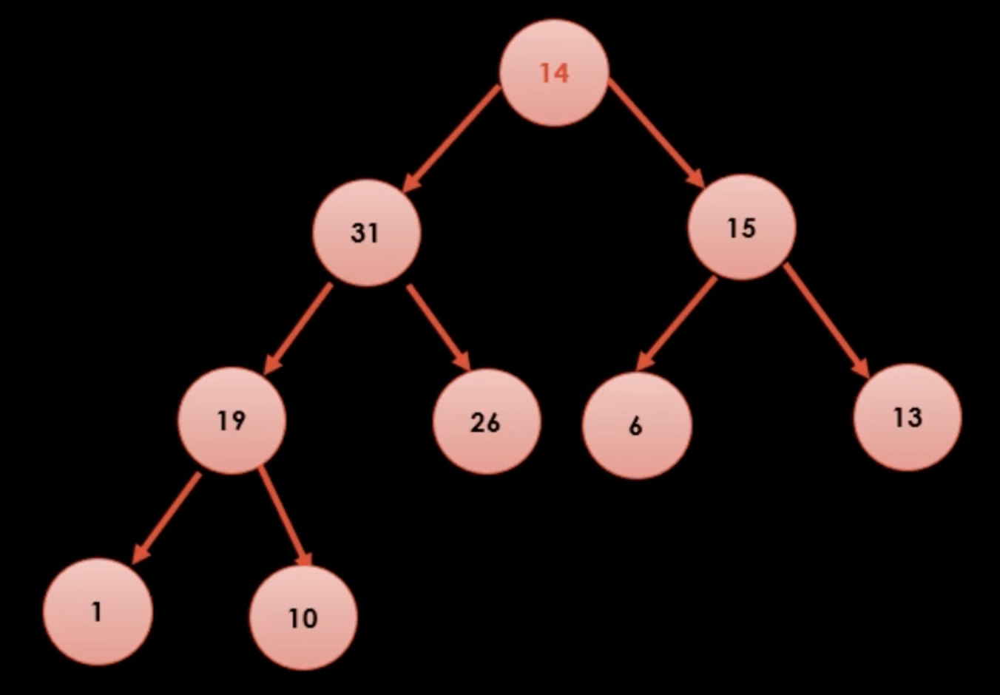

# Heap Tree (힙트리)

### 규칙 
1. 이진검색 트리보다 제약사항이 약한데, 부모가 가진 값이 자식이 가진 값보다 크기만 하면 된다. 즉, 양쪽 자식간에는 특별한 규칙이 없다. 따라서 root에 있는 노드가 항상 **최대값!**
2. 마지막 레벨을 제외한 모든 레벨에 노드가 꽉 차있다.
3. 새로운 항상 왼쪽부터 순서대로 채워야 한다.

### 특징
노드의 개수를 알면 트리 구조는 무조건 확정적으로 추론할 수 있다.
따라서 힙을 코드로 옮길 때 배열로 간단히 표현할 수 있고, 어떤 한 노드의 [부모노드], [왼쪽 자식노드], [오른쪽 자식노드]는 아래의 값과 같다.

- i번 노드의 왼쪽 자식은 [( i * 2) + 1] 번
- i번 노드의 오른쪽 자식은 [( i * 2) + 2] 번
- i번 노드의 부모는 [(i - 2) / 2] 번

### 새로운 값을 추가할 때

1. 우선 트리 구조부터 맞춘다.
2. 부모 노드와 값의 크기를 비교하여 새로 추가된 자식이 크면 값을 서로 바꿔준다. 더 이상 하극상(?)이 벌어지지 않을 때 까지.

### 최대값을 꺼낼 때

1. 최대값을 꺼내서 제거한다. 

2. 제일 마지막에 있는 노드를 루트로 올려준다 (이 경우엔 14) 

3. '역'도장깨기를 한다. 즉, 루트부터 작은 값을 대치하면서 내려간다. 
