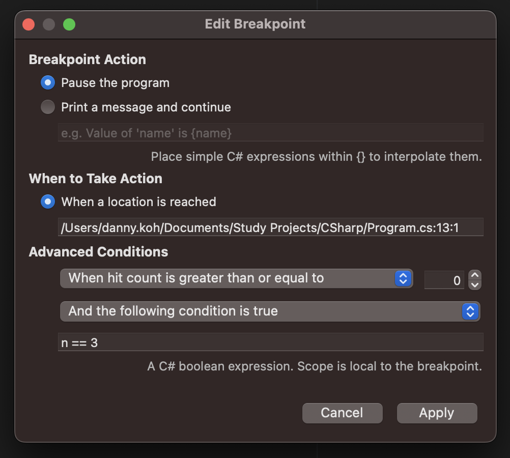

# Debugging

## Breakpoints

### [중단점 조건](https://learn.microsoft.com/ko-kr/visualstudio/debugger/using-breakpoints?view=vs-2022#breakpoint-conditions)
중단점에 조건을 설정하여 그 조건을 만족했을 경우에만 중단점이 실행되게 할 수 있다.

### 중단점 조건 설정 방법
1. 중단점에서 오른쪽 클릭 후 "조건(condition)" 선택
2. 이어서 열리는 설정 창에 필요한 조건식을 입력 후 적용한다.

[//]: <> (주의! Github에서는 inline style을 지원하지 않기 때문에 이미지가 의도와 다르게 렌더링됨.)
<figure style="text-align: center;">

<figcaption>(Visual Studio for Mac의 예시)</figcaption>
</figure>

3. 이후 디버그 모드로 프로그램을 실행시키면 설정한 조건이 만족할때만 중단점이 발동하는 것을 볼 수 있다. (디버깅 모드 도중에도 중단점 조건을 추가할 수 있어서 편리하다.)