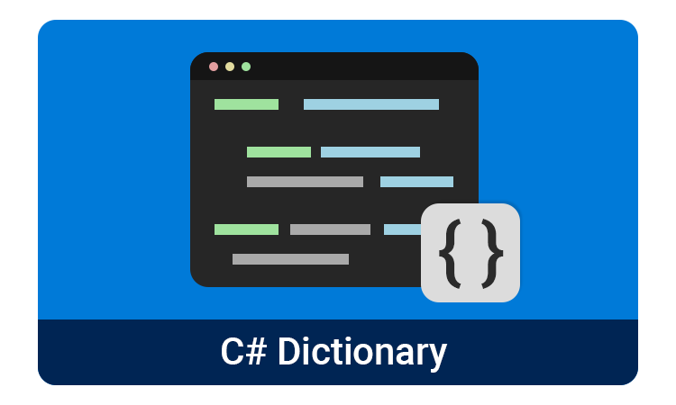

# List vs Dictionary
리스트나 어레이 같은 배열 대비 딕셔너리가 가진 장점과 단점을 알아보자.

## Dictionary의 장점
HashTable 타입

1. **Key-Value 페어링** 
딕셔너리는 Key와 Value를 쌍으로 저장하기 때문에 고유한 키로 Value를 빠르게 찾을 수 있다.

2. **Key 타입의 자유로움** 
어레이나 리스트는 키가 반드시 integer 타입이지만, 딕셔너리는 어떤 타입이라도 사용할 수 있다. string, 숫자는 물론 오브젝트 또한 키로 사용 가능.

3. **Flexibilty** 
어레이나 리스트는 반드시 같은 타입의 value만 저장할 수 있다. 하지만 딕셔너리는 서로 다른 타입의 데이터도 저장할 수 있기 때문에, 다양하고 반대한 데이터 구조를 다룰 때 유용하다.

4. **No Fixed Size** 
어레이는 고정 사이즈, 리스트는 사이즈를 줄이기 위해 별도의 작업을 해줘야 하지만 딕셔너리는 key-value pair을 추가하거나 삭제함으로써 자동으로 리사이징이 된다.

5. **Named Access** 
딕셔너리는 어레이, 리스트와 달리 string 타입의 key를 사용할 수 있기 때문에 "name", "age"와 같이 가독성에 좋은 코드를 짤 수 있다.

## Dictionary의 단점

1. **더 큰 메모리 사용** 
딕셔너리는 key와 value 모두 저장하기 때문에 메모리 사용면에서는 불리할 수 있다. 따라서 데이터 크기가 작은 경우에는 딕셔너리 보다는 어레이나 리스트를 사용하는게 Memory Overhead를 줄일 수 있다.
> *"메모리를 내어주고, 성능을 얻는다"* 

2. **고정된 순서의 부재 (Ordering)** 
일반적으로 딕셔너리를 데이터의 순서를 보존하지 않기 때문에, 순서를 보존하기 위해서는 [OrderedDictionary](https://learn.microsoft.com/ko-kr/dotnet/api/system.collections.specialized.ordereddictionary?view=net-7.0) 사용을 고려해야 한다.