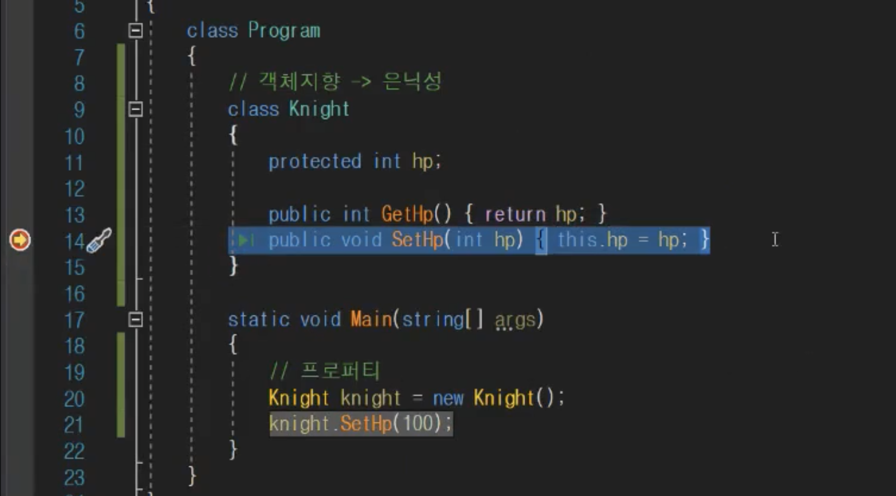

# Property

클래스 내부의 변수를 외부에서 접근할 수 있도록 public 접근자로 선언할 경우 의도치 않게 값을 변형하는 경우, 큰 프로젝트일때 어디서 변현된건지 추적하기가 매우 어려워지는 문제가 발생할 수 있다.
따서 프로퍼티를 사용하여 클래스 내부의 변수의 값을 안전하게 읽거나 쓰도록 한다.

## 장점

### 1. 캡슐화(은닉성)

- 캡슐화는 정보 은닉을 위해 클래스의 변수가 외부에서 접근이 안되도록 private 혹은 protected로 선언하여 외부에서 접근이 안되도록 한다.
- 프로퍼티는 public로 선언하고 getter과 setter을 사용하여 private/protected로 선언된 변수에 접근 가능하도록 한다.

```csharp
class Person
{
  private string age; // field

  public string Age   // property
  {
    get { return age; }   // get method
    set { age = value; }  // set method
  }
}
```

- 정보의 은닉을 위해 변수를 public이 아닌 private으로 선언했는데, getter/setter로 접근할 수 있으니까 왠지 public 변수가 차이가 없어보인다. 하지만 그럼에도 불구하고 프로퍼티를 사용하는 이유는 getter/setter을 이용할 때 조건을 걸어서 변수의 접근을 제어할 수 있기 때문이다.

```csharp
class Person
{
  private string age; // field
  public string Age   // property
  {
    get { return age; }
    set { 
      if(value == "29") // 조건을 걸어 값이 29일 때는 age를 ""로 초기화하도록 처리했다.
      { 
        age = "";
      } 
      else 
      { 
        age = value;
      }
    }
  }
}
```

### 2. Breakpoint로 추적

- 큰 프로젝트의 경우 특정 변수의 값을 어디서 변형시켜 오류를 유발하는지 추적하기가 힘든데, "Set변수"라는 함수로 제어한다면 해당 Set변수 함수에 중단점을 걸어 추적하기가 용이해진다.<br><br>


### 3. get; set;
- 위의 예에서 GetHp() / SetHp()의 함수를 써도 되지만 Get과 Set을 한번에 하는 더 간단한 문법이 있다. 아래 예를 보자.
```csharp
class Knight
{
    protected int hp;

    public int Hp
    {
        get {return hp;}
        set { hp = value; }
    }
}
```

### 4. 접근자 설정

아래와 같이 특정 클래스 범위에서만 get이나 set을 하게 하고 싶을 때 접근자 설정을 할 수도 있다.

```csharp
class Knight
{
    protected int hp;

    public int Hp
    {
        get {return hp;}
        private set { hp = value; }
    }

    void Test()
    {
        Hp = 100;
    }
}
```

### 더 줄여보자!
C#에서는 아래와 같이 프로퍼티 설정을 할 수도 있는데,

```csharp
class Knight
{
    public int Hp
    {
        get; set;
    }
}
```
이는 
```csharp
class Knight
{
    private int hp;
    public int GetHp() { return hp; }
    public void SetHp(int value) { hp = value; }
}
```
위 코드와 동일하지만 타이핑을 줄이고 가독성이 높아지는 장점이 있다.