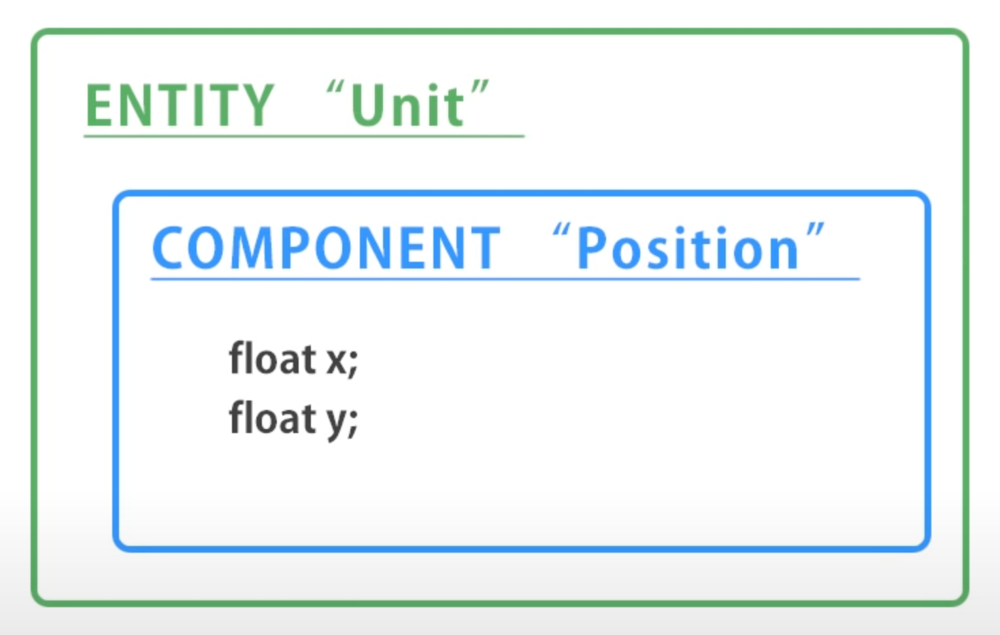
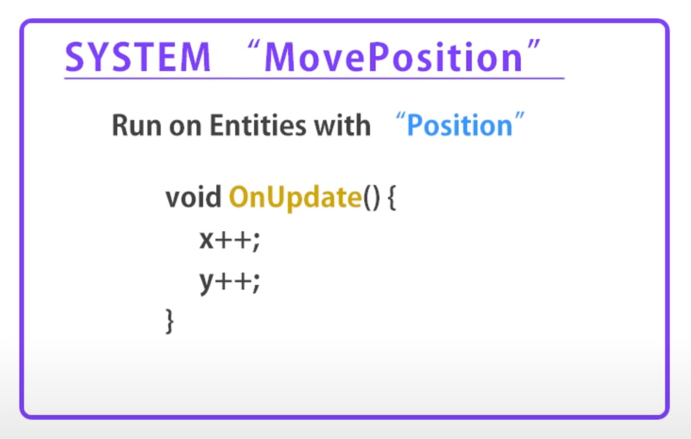

# Some Basics of DOTS
> DOTS stands for Data-Oriented Technology Stack

## Three Components of DOTS
1. C# Job System
2. Entity Component System
3. Burst Compiler

## Details

### C# Job System
Enables taking advantage of multi-core processors (multi-threading) in order to run several jobs at the same time. (Traditional Update method is operated in the single main thread.)  
Unity C# Job system automatically manages those threads and assign jobs to the thread via a simple code.

### Entities Component System
It's all about separating the logic and the data. 

Entity has its own component which holds the data. 

And the system has the logic which run on every entity that has the specified component. 

### Burst Compiler
Burst compiler takes your C# code and converts it to highly-optimized machine code. It can automatically take platform-specific optimization strategy depending on the platform you're using.

## Summary of workflow with DOTS
- Write code with ECS
- Jobify code with C# Jobs system
- Burst Compiler converts C# codes to optimized machine code