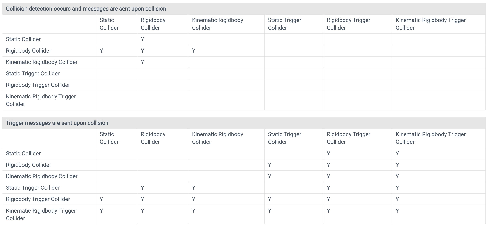

# Collision and Trigger

(Skipping general concept of colliders and triggers...)

### Static Colliders

You can add colliders to a GameObject without a Rigidbody component to create floors, walls and other motionless elements of a Scene. These are referred to as _**static colliders**_. At the opposite, colliders on a GameObject that has a Rigidbody are known as _**dynamic colliders**_. Static colliders can interact with dynamic colliders but since they don’t have a Rigidbody, they don’t move in response to collisions.

### Physics Materials

When colliders interact, their surfaces need to simulate the properties of the material they are supposed to represent. For example, a sheet of ice will be slippery while a rubber ball will offer a lot of friction and be very bouncy. Although the shape of colliders is not deformed during collisions, their friction and bounce can be configured using Physics Materials. Getting the parameters just right can involve a bit of trial and error. A slippery material like ice, for example, has zero (or very low) friction. A grippy material like rubber has high friction and near-perfect bounciness. See the reference pages for Physic Material and Physics Material 2D for further details on the available parameters. Note that for historical reasons, the 3D asset is actually called Physic Material
 (without the S) but the 2D equivalent is called Physics Material 2D
 (with the S).

 ### A Thing to Note

 With normal, non-trigger collisions, there is an additional detail that at least one of the objects involved must have a non-kinematic Rigidbody (ie, Is Kinematic must be switched off). If both objects are kinematic Rigidbodies then OnCollisionEnter, etc, will not be called. With trigger collisions, this restriction doesn’t apply and so both kinematic and non-kinematic Rigidbodies will prompt a call to OnTriggerEnter when they enter a trigger collider.

## Collision Action Matrix

### Useful Links

Unity Manual : https://docs.unity3d.com/Manual/CollidersOverview.html