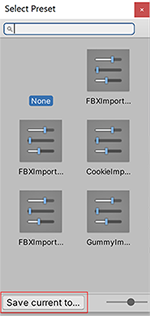

# Presets

여러 컴포넌트, 에셋 또는 프로젝트 설정 창에 동일한 프로퍼티를 저장하고 적용하는 데 사용하는 에셋이다.

또한 프리셋 관리자에서 새로운 컴포넌트에 대한 기본 설정과 에셋에 대한 기본 임포트 설정을 지정할 수 있다. 프리셋 관리자는 Unity 에디터에 추가하는 모든 임포터, 컴포넌트 또는 스크립터블 오브젝트를 지원한다.

프리셋은 에디터에서만 적용할 수 있고, 런타임 시 영향을 미치지 않는다.

### Preset 저장 방법

1. 슬라이더 버튼을 클릭

2. Save current to.. 버튼을 클릭

3. 새 프리셋의 위치를 선택하고 저장.

### Preset 적용

두 가지 방법으로 프리셋을 적용할 수 있다. Select Preset 창을 사용하거나, 또는 컴포넌트 프리셋의 경우 프리셋을 Project 창에서 해당 컴포넌트가 들어 있는 게임 오브젝트로 드래그 앤 드롭할 수 있다.

1. 프리셋을 적용할 게임 오브젝트 또는 에셋을 선택하여 Inspector 창에 표시한다. 프리셋을 적용할 프로젝트 설정의 경우 Project Settings 창에서 엽니다.

2. Inspector 에서 프리셋 설정 아이콘를 클릭한다.

3. Select Preset 창에서 적용할 프리셋을 검색하여 선택한다. Unity가 이 프리셋을 컴포넌트, 에셋 또는 프로젝트 설정 창에 적용한다.

4. Select Preset 창을 닫는다.

그 밖의 내용은 유니티 매뉴얼에 잘 정리되어있음. 
(Link: https://docs.unity3d.com/kr/current/Manual/Presets.html)
