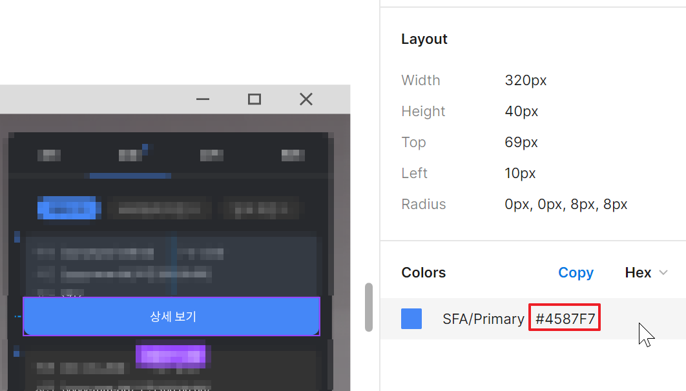

# Color Converter Util

UX/UI 디자이너와 협업할 땐 [Figma](https://www.figma.com/design-overview/)와 같은 툴을 주로 사용하고,  Color 정보를 RGBA값이 아닌 HEX 코드(형식 #AAAAAA)로 전달받게된다.

---

<figure>

<figcaption>Figma. Property 창을 보면 컬러 정보가 Hex 코드로 들어있다.
</figure>

---

이럴 경우 `ColorUtility.TryParseHtmlString`를 사용하면 Color 데이터로 변환할 수 있는데, 이를 이용한 Utility 스크립트를 만들어두면 프로젝트 내 여러군데서 편리하게 사용할 수 있다.

```cs
public static class ColorConverter
    {    
        public static Color HexToColor(string hex)
        {
            if (!hex.StartsWith("#"))
            {
                hex = $"#{hex}";
            }

            if (ColorUtility.TryParseHtmlString(hex, out Color color))
            {
                return color;
            }
            else
            {
                Debug.LogError($"Failed to convert hex string to color: {hex}");
                return Color.white;
            }
        }
    }
```

실제로는 사용할 때는 
```cs
Color myColor = ColorConverter.HexToColor("#4587F7")
```
이렇게 사용하면 됨.