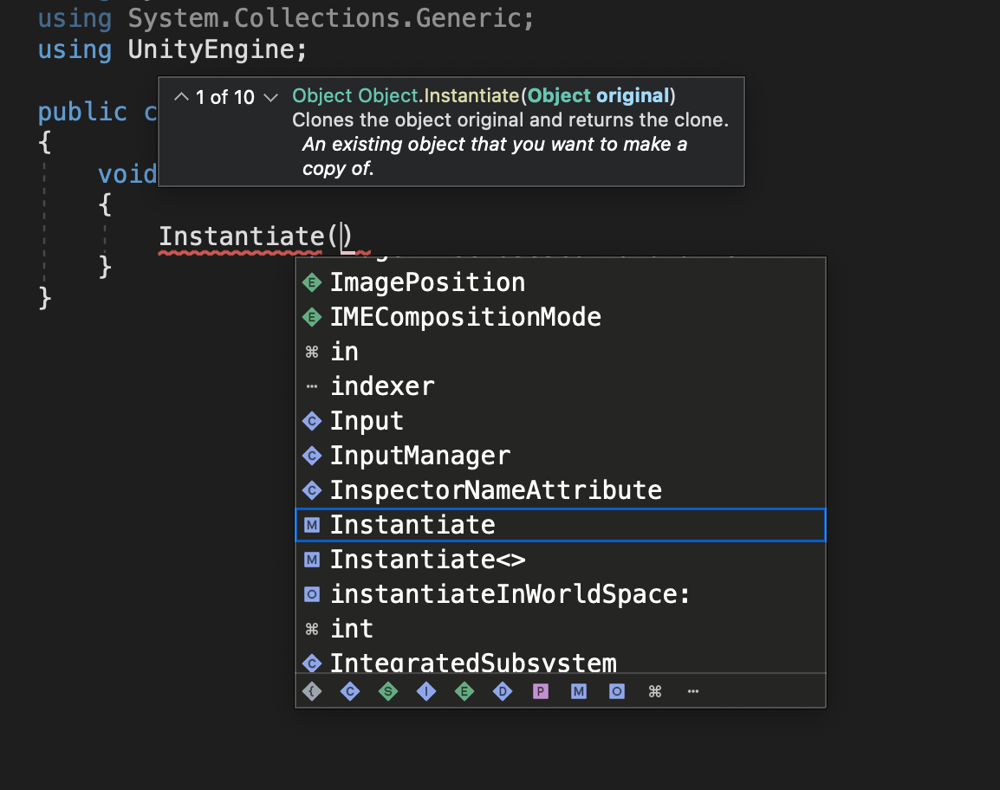

# How to scroll through overload methods?

IntelliSense 팝업이 나타났을 때, 단순히 arrow키만 누르면 아래에 있는 명령어 목록에서 스크롤을 한다.

 이럴 때 Ctrl + Shift + Space를 먼저 한번 누른 후 arrow키를 누르면 정상적으로 overload 함수 목록을 scroll할 수 있다.

 ### 수정 (2023.10.27)

 Ctrl + Shift + Space를 눌러도 되지만 간단히 ESC 키를 눌러도 동일한 효과를 볼 수 있다.